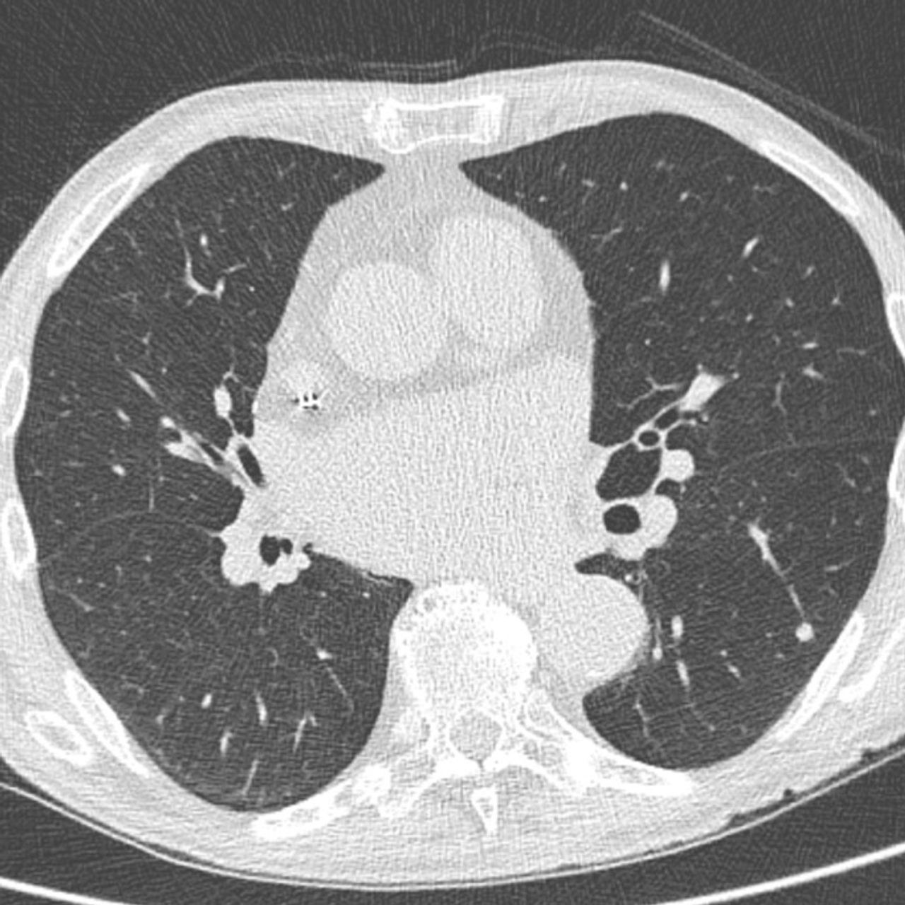
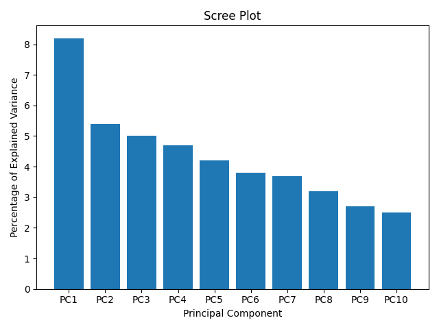

# Pulmonary Fibrosis

This project's goal is to predict a patient's severity of decline in lung function based on 
their CT scans of lungs. With good accuracy of prediction, patients and their families would
better understand their prognosis when they are first diagnosed with this incurable lung disease.
Improved severity detection would also positively impact treatment trial design and accelerate 
the clinical development of novel treatments.

## Methods and tools

* Custom data generators, loss functions, training loops - Tensorflow, Keras backend
* Transfer learning - EfficientNetB5
* Clustering - autoencoder, K-Means, sklearn
* Dimensionality reduction - PCA
* Models - CNN, autoencoder, Tensorflow, Keras
* Data Manipulation, Feature Engineering - Pandas, Numpy
* EDA, Visualization - Pandas, matplotlib, seaborn, scipy, Jupyter

## Result
After many attempts I keep getting some issues with my loss function which is probably due 
to the fact that I freeze a part of layers after every batch, and it causes some internal
conflicts in backpropagation process and results in poor learning. Other than that, the
model is strongly suitable for such computer vision task and after fixing the loss-function
issue it will be ready to perform high-accuracy predictions.
